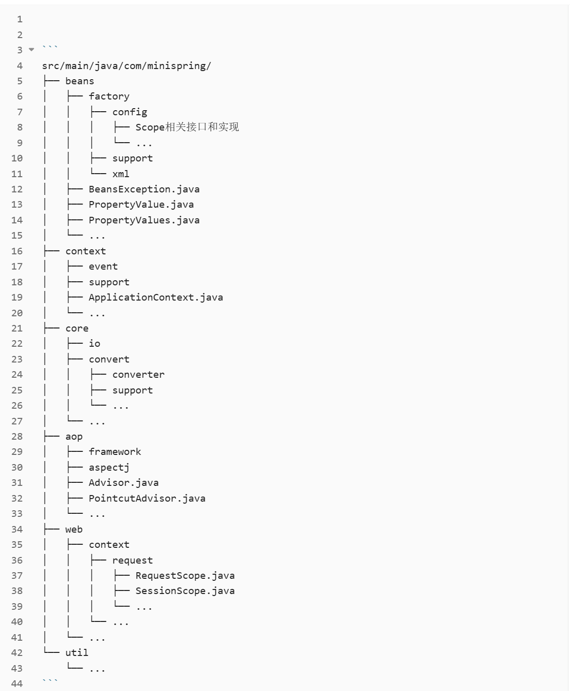

# mini-spring2.0

项目描述： 基于Java语言从零开始实现Spring框架核心功能，通过对Spring源码的深入分析和理解，手写实现包含IoC容器、AOP、事务等核心功能的简化版Spring框架。

学习路线： 

项目结构：

核心功能： 
Mini-Spring实现了以下Spring核心功能： 
1.IoC容器：依赖注入和控制反转 ✅ 
2.AOP：面向切面编程 ✅ 
3.Bean生命周期管理：实例化、初始化、销毁 ✅ 
4.应用上下文：配置和环境管理 ✅ 
5.资源加载：类路径和文件系统资源 ✅ 
6.事件监听机制：发布订阅模式 ✅ 
7.类型转换：基本类型和自定义类型转换 ✅ 
8.Bean作用域：单例、原型及Web作用域 ✅ 
9.循环依赖支持✅